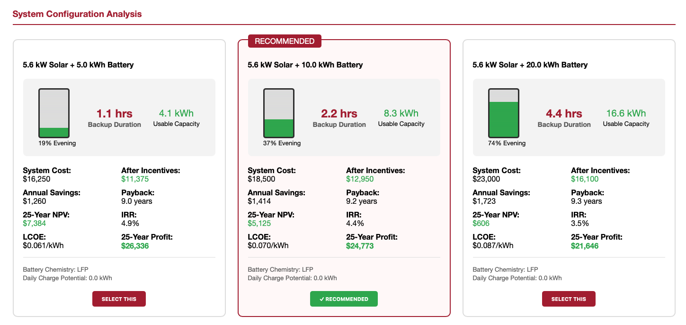

# M3. Data Analysis — Solar PV + Battery Sizing

This milestone tests the core research question with transparent, reproducible analysis rather than heavyweight ML. Methods must match the data we have (PVWatts outputs, tariff data, and user load/cost assumptions) and clearly communicate uncertainty.

## Scope and approach
- **Objective:** Recommend feasible PV + battery size bands for U.S. households using public data, while surfacing savings, payback, and backup-hour ranges.
- **Inputs:** PVWatts v8 production (`ac_annual`, `ac_monthly`, `capacity_factor`), URDB/NREL utility tariffs, user-entered load and system cost assumptions (see `scripts/config.py`), optional SREC mappings.
- **Methods:** Scenario tables across PV kW × battery kWh, bar/line charts for annual savings and payback, sensitivity on tariffs and system costs, and backup-hour estimates for critical loads.
- **Uncertainty handling:** Present ranges (best/base/conservative) to reflect weather variability, tariff coverage gaps, and simplified load profiles; state caveats explicitly.

## Data dependency and provenance
- **Upstream dataset:** `2_data_collection/data/processed/solar_analysis_dataset.csv` (8 locations). Schema and pipeline are documented in `2_data_collection/data/README.md`; upstream scripts pull Nominatim geocodes, PVWatts v8 production, Utility Rates v3 tariffs, and static SREC/ITC/cost tables.  
- **Upstream artifacts:** Raw API pulls live in `2_data_collection/data/raw/` (`geocode_results.json`, `pvwatts_results.json`, `utility_rates_results.json`). Visuals from M2 (irradiance, rates, SREC maps) are in `2_data_collection/data/visualizations/`; load profile mock is `2_data_collection/loadprofile.png`.  
- **Fields consumed here:** `ac_annual_kwh`, `ac_monthly*`, `capacity_factor`, `electricity_rate_residential`, `utility_name`, `srec_price_per_mwh`, `system_cost_net`, `annual_savings`, `simple_payback_years`, `annual_srec_revenue`, `data_quality_score`.  
- **Known limitations (must be repeated in results):** PVWatts uses TMY (±10–15% variance), URDB has ~15% utility gaps (state-average fallback), no shading or azimuth/tilt optimization (tilt = latitude, south-facing), 14% fixed losses, SREC prices are static snapshots.  
- **Refresh guidance:** If you change locations, rerun the M2 pipeline before analysis (`fetch_geocode.py → fetch_pvwatts.py → fetch_rates.py → clean_merge_dataset.py → generate_visualizations.py`). Keep raw pulls in `2_data_collection/data/raw/` and outputs in `processed/`.

## Current findings and gaps
- **Status:** Final figures are not yet documented in this folder. The Flask prototype (`scripts/`) renders best/base/conservative scenarios interactively, but the static non-technical summary and technical appendix still need to be exported here.
- **Required actions to complete M3:**
  - Run the analysis notebook or script to generate savings/payback charts for representative ZIPs (e.g., CA, TX, FL) and export visuals.
  - Write the non-technical summary that explains results, confidence levels, and caveats for homeowners.
  - Document the technical methods, assumptions, and alternative approaches considered.
  - Add group/individual retrospectives and note survey completion.

## Reproducibility
- **Environment:** `python -m venv .venv && source .venv/bin/activate && pip install -r scripts/requirements.txt`.
- **Data pull:** Prefer reusing the processed CSV from M2. If regenerating, run the M2 pipeline in `2_data_collection/data/` (see that README) with `NREL_API_KEY` set in `.env` to refresh geocode/PVWatts/URDB data and SREC mappings.
- **Execution:** Place notebooks or scripts for analysis under `3_data_analysis/` and export figures to this folder (or to `4_Communicating_Results/` if reused for M4). Record command order and expected inputs/outputs alongside the artifacts.
- **Inputs/outputs:** Keep any new raw pulls in `data/raw/` (git-ignored) and processed outputs in `data/processed/`; include a short README if new files are added. If you modify the schema, update both this file and `2_data_collection/data/README.md`.

## Reference asset

*Illustrative PV + battery options from the prototype: compares backup duration, usable capacity, costs, payback, and long-run profit for different battery sizes at a fixed PV size.*
